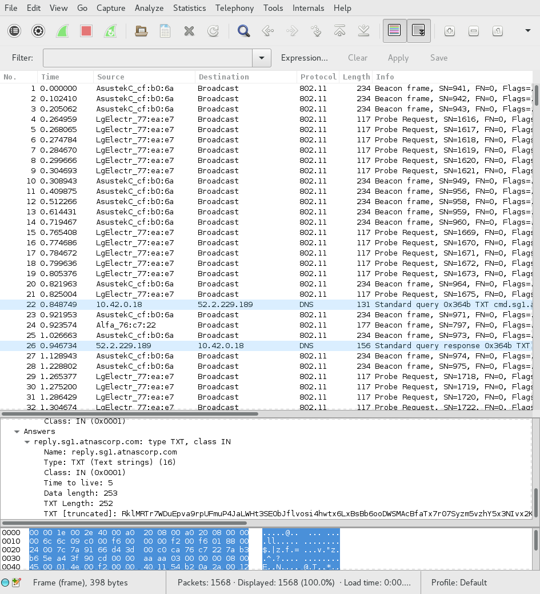
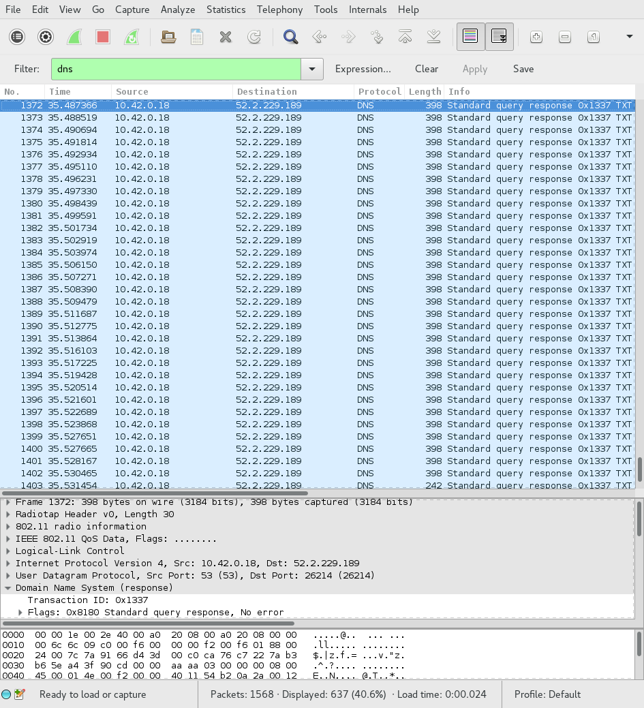
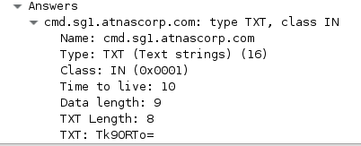

# Part 1
## Process
We are given a packet capture to analyze, `giyh-capture.pcap`. Let's open it in
Wireshark:



That's quite a lot of 802.11 control packets. I doubt that's the control
channel, though. Let's take a look at those DNS requests, those seem more
interesting. We can filter by using the filter expression `dns`:



Looks like some of those queries are for "cmd.sg1.atnascorp.com". That seems
awfully suspicious. Let's look at a response for one of those queries:



Looks like base64 encoding. Let's bring up a shell and try it:

```sh
ruby :: holidayhack/part1 » echo Tk90RTo= | base64 -d
NOtE:
```

Yep. Looks like all of the other replies for "cmd.sg1.atnascorp.com" are the
same thing. Let's look at the responses for "reply.sg1.atnascorp.com" instead.
All of them have a transaction ID of 0x1337, so we can simply use the filter
expression `dns.id == 0x1337`.

Looking at the first response:

```sh
ruby :: holidayhack/part1 » echo RVhFQzpTVEFSVF9TVEFURQ== | base64 -d
EXEC:START_STATE
```

Yep, this is definitely what we want. Unfortunately, this is too much data to
analyze using copy-paste from Wireshark. Fortunately, we can use the `tshark`
command-line tool to extract the data we want:

```sh
ruby :: holidayhack/part1 » tshark -Tfields -e dns.txt -r giyh-capture.pcap "dns.id == 0x1337"
RVhFQzpTVEFSVF9TVEFURQ==
- snip -
RVhFQzogICAgICAgICAgICAgICAgICAgIENoYW5uZWw6Ngo=
```

Essentially, what we are doing is taking every packet that matches our filter
expression `dns.id == 0x1337` and getting the value of the `dns.txt` field,
which is the query response. Now we can do some analysis. Let's start by
getting `tshark`'s output into a file:

```sh
ruby :: holidayhack/part1 » !! > query_responses
ruby :: holidayhack/part1 »
```

And let's base64 decode every line in that file:

```sh
ruby :: holidayhack/part1 » for i in `cat query_responses`; do
echo $(echo $i | base64 -d)
done | nl | less
```

The output is piped to `nl` so we can get line numbers, and piped to `less` so
we can review it for anything interesting manually. As it turns out, there is
something very interesting. On line 84, we see a command being sent:

```
    84  FILE:START_STATE,NAME=/root/Pictures/snapshot_CURRENT.jpg
```

The following lines contain binary data with the JPEG image.


Now to actually extract the file. Josh started writing a script for us, but I
decided to ignore it, since he claimed it was broken. We know that every line
is base64 encoded, and every line starts with the string `FILE:`. We know that
the last line is an end marker, so we should ignore that as well. Keeping all
that in mind, we can write a script to:

- Give us lines starting at the 85th line
- Give us characters starting at the 6th character ("FILE:" is 5 characters)
- Skip the last line
- Not write newlines between commands
- Output all of this to an image

I implemented this in Python. Here's the source:

```py
# The DNS responses are base64-encoded
import base64

# We want lines starting at the 85th, but we're using a zero-based system
lines = [i.strip() for i in open("query_responses").readlines()][84:] 

# Let's have the image data accumulate in this variable
image_data = b""

for line in lines:
    # We want to base64 decode the entire line, then take everything past the
    # 5th character ("FILE:" is 5 characters). Let's add it to the variable
    # we defined above
    image_data += base64.b64decode(line)[5:]

# Great, now all of our data is in the image_data variable. Let's write it out
# to an image so we can actually use it:

with open("image.jpg", "wb") as image_file:
    image_file.write(image_data)
```

**Part 1b answer:**

Once we run this script, we get the file "image.jpg", which appears to contain
a picture of a bedroom:


There you have it! We're done with Part 1!

## Answer
### a
The `FILE:START_STATE` command is sent, indicating that a file is about to be
sent across the network.

### b
The image is shown above.
