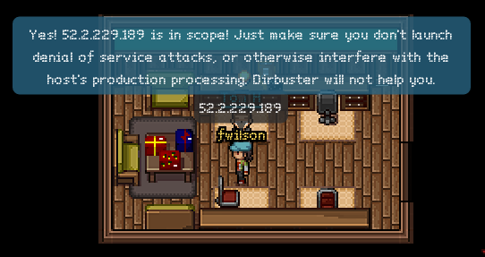
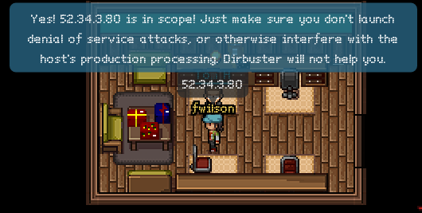

# Part 2
## Process
This time, we're given a firmware image, and asked to try to retrieve a password
from it. In addition, we are to answer the following questions:

- What operating system and CPU type are in the Gnome? What type of
web framework is the web interface built in?
- What kind of a database engine is used to support the Gnome's web interface?
What is the plaintext password?

One of my favorite tools for firmware analysis is `binwalk`. It "walks" across
a file, and tries to find file headers that match types that it knows about.
Let's try running it on our firmware image:

```sh
ruby :: holidayhack/part2 » binwalk giyh-firmware-dump.bin 

DECIMAL       HEXADECIMAL     DESCRIPTION
--------------------------------------------------------------------------------
0             0x0             PEM certificate
1809          0x711           ELF 32-bit LSB shared object, ARM, version 1 (SYSV)
168803        0x29363         Squashfs filesystem, little endian, version 4.0, compression:gzip, size: 17376149 bytes,  4866 inodes, blocksize: 131072 bytes, created: Tue Dec  8 18:47:32 2015
```

Aha! That Squashfs filesystem most likely has the files we need. Let's first
extract it from the image using `binwalk -e`:

```sh
ruby :: holidayhack/part2 » binwalk -e giyh-firmware-dump.bin 

DECIMAL       HEXADECIMAL     DESCRIPTION
--------------------------------------------------------------------------------
0             0x0             PEM certificate
1809          0x711           ELF 32-bit LSB shared object, ARM, version 1 (SYSV)
168803        0x29363         Squashfs filesystem, little endian, version 4.0, compression:gzip, size: 17376149 bytes,  4866 inodes, blocksize: 131072 bytes, created: Tue Dec  8 18:47:32 2015

ruby :: holidayhack/part2 » cd _giyh-firmware-dump.bin.extracted 
ruby :: part2/_giyh-firmware-dump.bin.extracted » ls
0.crt  29363.squashfs
```

Now we have our Squashfs image. We can extract it using the `unsquashfs`
utility (from the `squashfs-tools` package). Let's do that:

```sh
ruby :: part2/_giyh-firmware-dump.bin.extracted » unsquashfs 29363.squashfs 
Parallel unsquashfs: Using 4 processors
3936 inodes (5763 blocks) to write

[===================================================================================================================/] 5763/5763 100%

created 3899 files
created 930 directories
created 37 symlinks
created 0 devices
created 0 fifos
```

Now, we have the Gnome's root filesystem in the `squashfs-root` folder. Let's
see if there's anything interesting:

```sh
ruby :: _giyh-firmware-dump.bin.extracted/squashfs-root » ls
bin  etc  init  lib  mnt  opt  overlay  rom  root  sbin  tmp  usr  var  www
ruby :: _giyh-firmware-dump.bin.extracted/squashfs-root » file init 
init: POSIX shell script, ASCII text executable
```

Huh, that's interesting. `init` usually isn't in the root directory, and it's
usually not a text file. Let's take a look:

```sh
ruby :: _giyh-firmware-dump.bin.extracted/squashfs-root » cat init 
#!/bin/sh
# Copyright (C) 2006 OpenWrt.org
export INITRAMFS=1
exec /sbin/init
```

That copyright string is helpful. It means that the operating system running is
likely OpenWRT, which is Linux-based. Let's take a quick look at `/sbin/init`,
and see if it has any clues:

```sh
ruby :: _giyh-firmware-dump.bin.extracted/squashfs-root » file sbin/init
sbin/init: ELF 32-bit LSB executable, ARM, EABI5 version 1 (SYSV), dynamically linked, interpreter /lib/ld-musl-armhf.so.1, stripped
```

So the gnome has an ARM processor. That could come in handy later.

That `www` folder seemed interesting. Let's look there next:

```sh
ruby :: _giyh-firmware-dump.bin.extracted/squashfs-root » cd www 
ruby :: squashfs-root/www » ls
app.js  bin  files  node_modules  package.json  public  routes  views
```

Hmm, `app.js`? `node_modules`? Sounds like this is a Node.js application.
Let's take a look at `app.js` to see if we can find anything more:

```sh
ruby :: squashfs-root/www » cat app.js
var express = require('express');
- snip -
var mongo = require('mongodb');
var monk = require('monk');
var db = monk('gnome:KTt9C1SljNKDiobKKro926frc@localhost:27017/gnome')

var app = express();
- snip -
```

This gives us a lot of helpful information. We now know that the web interface
is based on node.js, using the Express framework, and that it is using MongoDB
as a database backend. Let's take a look to see if we can find the web
interface password from MongoDB's data files. First, let's try to find MongoDB's
data directory:

```sh
ruby :: squashfs-root/etc » cat mongod.conf 
- snip -
storage:
  dbPath: /opt/mongodb
- snip -
```

Okay, let's take a look in `/opt/mongodb` then:

```sh
ruby :: _giyh-firmware-dump.bin.extracted/squashfs-root » cd opt/mongodb 
ruby :: opt/mongodb » ls
gnome.0  gnome.ns  journal  local.0  local.ns  _tmp
```

Let's use the tool `strings` to take a look at the `gnome.0` file. What
`strings` will do is find all groups of printable characters in the given file
longer than a certain length, and show them to us. If we're lucky, the password
will be among those groups. Let's try it:

```sh
ruby :: opt/mongodb » strings gnome.0
- snip -
username
admin
password
SittingOnAShelf
- snip -
```

Aha! Looks like the password is "SittingOnAShelf".

## Answer
### a
OpenWRT (a Linux derivative) is running on an ARM processor on the Gnome. The
web framework used is Express, which uses Node.js.

### b
MongoDB is used to support the web interface. The plain-text password is
"SittingOnAShelf".

# Part 3
## Process

In this part, we are told to locate "SuperGnomes", which are some sort of master
control nodes. The hint "sho Dan" of course points to the Shodan.io tool, which
allows us to search the Internet for devices that match a query. One way to
target Gnome devices would be to use the title of the index page they display.
Let's take a look at one the index template:

```sh
ruby :: squashfs-root/www » cat views/index.jade 
extends layout
- snip -
```

Okay, let's go to the layout template:

```sh
ruby :: squashfs-root/www » cat views/layout.jade 
- snip -
    head
      title= title
- snip -
```

Let's take a look at where these pages are rendered to get the value of the
`title` variable:

```sh
ruby :: squashfs-root/www » cat routes/index.js | grep title
      res.render('index', { title: 'GIYH::ADMIN PORT V.01', session: sessions[sessionid], res: res });
- snip -
```

Now that we know the webpage title, let's try searching some of those words in
Shodan:


Awesome. Excluding "92.84.56.10" (which doesn't seem to be part of the
challenge), we have five nodes, presumably SuperGnomes. Let's go confirm them
with Tom:






## Answer

Our nodes are:
- 54.233.105.81, in Brazil
- 52.192.152.132, in Japan
- 52.2.229.189, in the US (Ashburn)
- 52.64.191.71, in Australia
- 52.34.3.80, in the US (Boardman)
